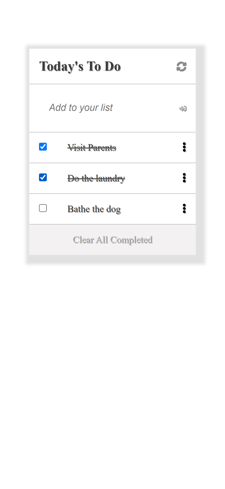

# TO-DO-LIST 
> This is a **To Do List Project** that dynamically displays tasks to be done with interactions for removing and adding task when completed or not.

> |Mobile Version|Desktop Version|
> |--------------|-----------------|
> |.||

- The To Do List Project is a website project that helps the user organize his/her day by allowing the user do the following:

- Add tasks to be done
- Mark each tasks as completed when the user has done the tasks.

The website allows the user do the following:

- Add a new task
  
- Remove a selected task

- Mark a selected task as complete

- Remove all completed tasks at once from the list of tasks

- Repriorirtize tasks by dragging tasks up and down the list

## Built With

- HTML, CSS, JavaScript
- Git, Github, Webpack

## Prerequisites
Basic understanding of HTML, JavaScript, CSS Git and GitHub

[Live Demo Link](https://gambit142.github.io/To-Do-List-Project/)

## Getting Started

### To get a local copy up and running follow these simple example steps below:

1. Copy this website **``https://github.com/Gambit142/To-Do-List-Project``**
2. Navigate to the location of the folder in your machine you wish to save this folder:
**``you@your-Pc-name:~$ cd <folder>``**
3. Clone this repository or download the Zip folder:
**``https://github.com/Gambit142/To-Do-List-Project.git``**
4. Change Directory into the cloned repository: **``you@your-Pc-name:~$ cd <To-Do-List-Project>``**
5. Open the repository with Visual Code Editor: **``you@your-Pc-name:~$ code .``** or open with any code editor of your choice.

## Authors

👤 **Francis Nzenwa Ugorji**

- GitHub: [@Gambit142](https://github.com/Gambit142)
  
- LinkedIn: [Francis Ugorji](www.linkedin.com/in/francis-ugorji-a567b7168)

## 🤝 Contributing

Contributions, issues, and feature requests are welcome!

Feel free to check the [issues page](../../issues/).

## Show your support

Give a ⭐️ if you like this project!

## Acknowledgments

- **``Microverse``** for the opportunity to underatake such project using their platform
- To family and friends who motivated us throughout this project
- To [Minimalist](https://web.archive.org/web/20180320194056/http://www.getminimalist.com:80/) for the design template used in this project
## 📝 License

This project is [MIT](./MIT.md) |licensed.
